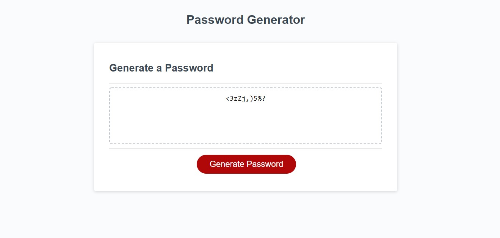

# Password Generator
* [General Info](#General-Info)
* [Technology](#Technology)
* [Setup](#Setup)
* [Preview](#preview)

## General Info
This is a Javascript that takes user inputs about requirements and creates a random password string
* Asks user a length between 8 and 128 character
* Asks whether they want to include lowercase, uppercase, numbers and special characters
* Validates that a proper value has been entered and at least one character type is chosen

## Technologies
Page is built using HTML, CSS and Javascript

## Preview

